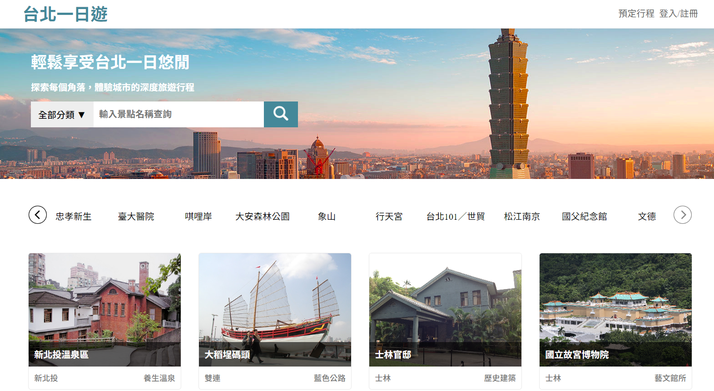
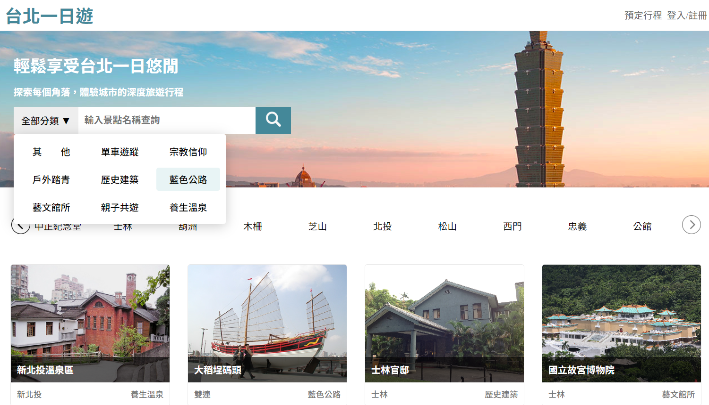
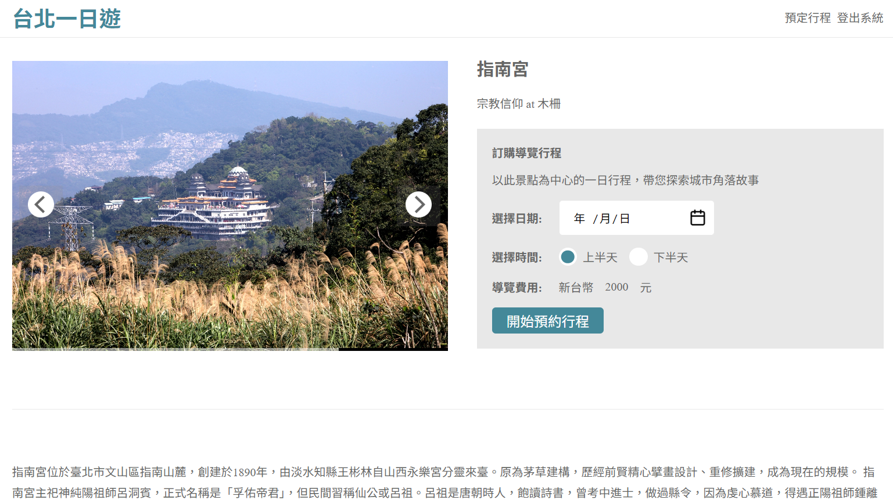
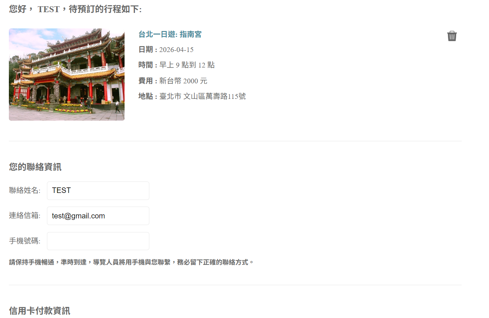
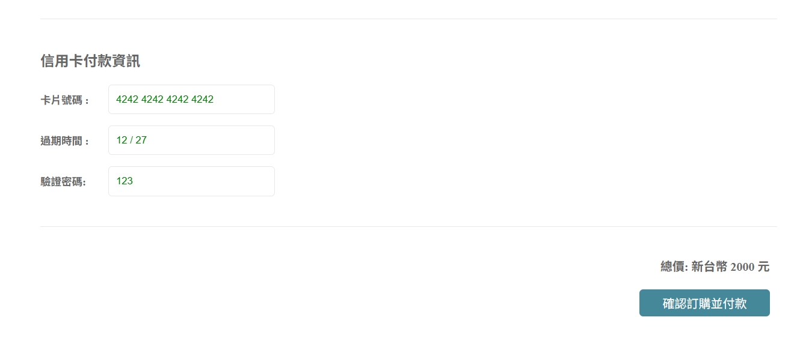
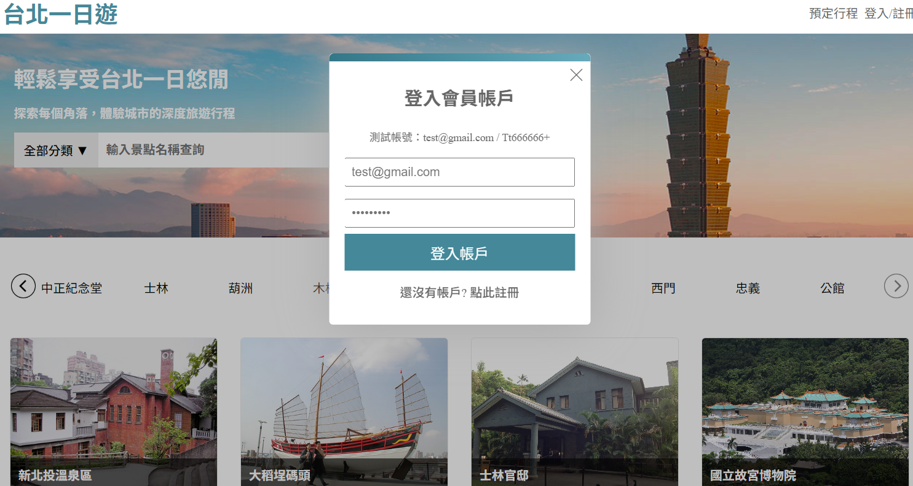

# 🧳 Taipei Day Trip - 台北一日遊旅遊預訂平台
### 提供景點搜尋、捷運分類與線上預訂的一站式旅遊服務平台，整合第三方金流完成完整訂單流程。

## 📌 專案簡介
Taipei Day Trip 是一個旅遊平台，讓使用者可以：

  🔍 搜尋台北景點
  
  🚇 依捷運站分類瀏覽
  
  📅 預訂行程
  
  💳 線上付款完成訂單

此專案重點在於完整電商流程（搜尋 → 預訂 → 付款）與前後端整合能力。

## 🎯 核心功能
**1️⃣ 景點搜尋系統**
  - 關鍵字搜尋景點
  - 分頁載入（Infinite Scroll）
  - 圖片輪播顯示

**📸 景點列表畫面：**

**2️⃣ 捷運分類瀏覽**
  - 依 MRT 站點分類景點
  - 快速篩選附近景點

**📸 捷運分類：**

**3️⃣ 景點詳細頁**
  - 圖片輪播
  - 景點介紹
  - 預訂表單（日期 / 時段 / 價格）

**📸 景點詳細頁：**

**4️⃣ 行程預訂功能**
  - 選擇日期與時段
  - 自動計算價格
  - 建立訂單

**📸 預訂畫面：**

**5️⃣ 金流支付（TapPay）**
  - 串接 TapPay 第三方金流
  - 信用卡付款
  - 建立付款成功訂單

**📸 付款流程：**

**6️⃣ 會員系統**
  - 註冊 / 登入 / 登出
  - JWT 驗證
  - 訂單紀錄查詢

**📸 會員頁面：**

